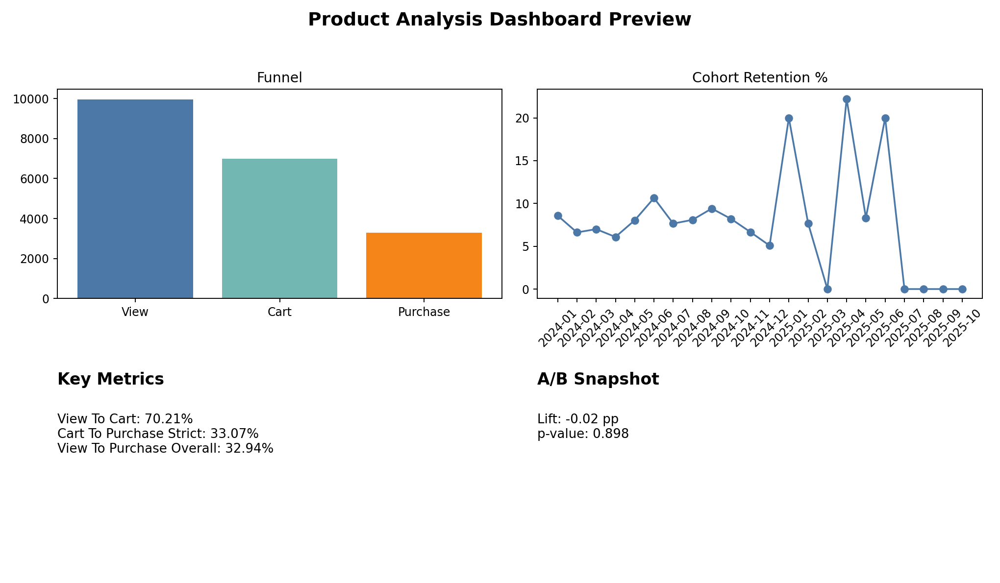
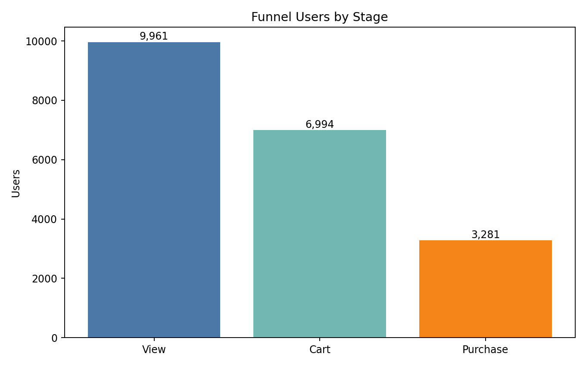
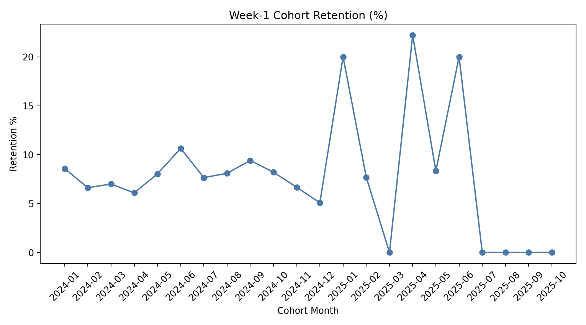
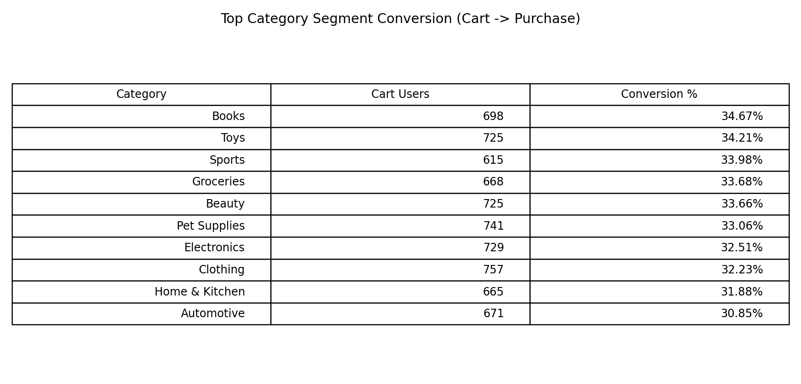

This project analyzes e-commerce user behavior to identify funnel drop-offs and proposes data-driven improvements to increase conversion and early retention.

# Product Analysis

End-to-end product analytics: funnel, cohort retention, segmentation, and experimentation.

## Project structure

```
Product_Analysis/
├── data/
│   ├── raw/           # Source CSVs (do not edit)
│   └── processed/     # Derived tables, DuckDB, exports
├── sql/               # Ad-hoc and reusable analytics queries
├── notebooks/         # Exploration and validation
├── dashboard/         # Interactive app (e.g. Streamlit)
└── README.md
```

## Data

Place source extracts in `data/raw/`. Store processed outputs in `data/processed/`.

## Funnel analysis (Step 7)

User-level funnel: users with **at least one** `view` → `cart` → `purchase` ([`docs/DEFINITIONS.md`](docs/DEFINITIONS.md)).

| Stage | Users |
|-------|------:|
| View | 9,961 |
| Cart | 6,994 |
| Purchase | 3,281 |

| Conversion | Rate |
|------------|-----:|
| View → Cart | 70.21% |
| Cart → Purchase | **33.07%** *(strict: cart users who also have ≥1 purchase)* |
| View → Purchase (overall) | 32.94% (any purchaser / viewers with ≥1 view) |

**Primary bottleneck (senior framing):** Post-cart completion is the main constraint: among users with a recorded `cart`, only **~33%** also have a `purchase`, which points to checkout/decision friction more than product discovery.

**Intent vs. completion:** View→cart is relatively strong (~70%), so many users signal interest, but failure to convert after cart suggests pricing, checkout UX, or trust — not just awareness.

**Largest leak (step-level):** Cart → purchase loses the most users (conditional drop vs view → cart).

## Segmentation (Step 8) — cart → purchase *(strict)*

**Segments chosen:** `gender` (from `users.csv`) and **primary cart category** (category most often added to cart per user, from `events` × `products`).

Among users with **≥1 cart**, share who also have **≥1 purchase**:

| Gender | Cart users | Cart→Purchase |
|--------|-----------:|--------------:|
| Other | 2,442 | 32.51% |
| Male | 2,268 | 32.72% |
| Female | 2,284 | **34.02%** |

| Primary cart category | Cart users | Cart→Purchase |
|-----------------------|-----------:|--------------:|
| Automotive | 671 | **30.85%** |
| Home & Kitchen | 665 | 31.88% |
| Clothing | 757 | 32.23% |
| Electronics | 729 | 32.51% |
| Pet Supplies | 741 | 33.06% |
| Beauty | 725 | 33.66% |
| Groceries | 668 | 33.68% |
| Sports | 615 | 33.98% |
| Toys | 725 | 34.21% |
| Books | 698 | **34.67%** |

*(Spread ≈4 pp lowest vs highest; “primary category” = most frequent `cart` event category per user.)*

**Insight:** Gender differences are small (~1.5 pp) — demographic slice is not the main driver here.

**Insight:** **Automotive** (and to a lesser extent **Home & Kitchen**) underperform on cart→purchase vs **Books**/**Toys**, suggesting category-specific pricing, consideration cycle, or trust — not a single global UX fix.

*Tracking / funnel baseline notes:*
- **34 users** have no `view` in the log (wishlist/cart/purchase only). They are excluded from the primary view-based funnel baseline; this may reflect tracking gaps or alternate entry paths.
- **968 users** have `purchase` without any `cart` event (e.g. buy-now, direct checkout, or logging gaps). **Strict cart→purchase** = users with ≥1 cart **and** ≥1 purchase (**2,313 / 6,994 ≈ 33.1%**). A looser rate that counts all purchasers in the numerator (**3,281 / 6,994 ≈ 46.9%**) mixes in purchases that did not go through a logged cart step — segment analyses below use the **strict** definition.

## Cohort Retention Curves (Step 9) — Week-1
**Cohort definition:** user’s first event date (`min(event_timestamp)` per `user_id`).  
**Week-1 retention definition:** user has **any event** in `[first_event_ts + 7d, first_event_ts + 14d)`.

Overall **week-1 retention:** **7.72%** (active in days 7–14 after first event).

Interpretation: week-1 retention is low, suggesting most user journeys do not become sustained engagement in the first week; early funnel work should be paired with a plan for durable post-purchase (or post-activation) engagement.

## A/B Test (Step 10) — Feature X vs Control
Because the dataset does not include real randomized experiment assignment, the dashboard/script uses **deterministic simulated assignment** at the `user_id` level.

**Hypothesis:** improving checkout experience increases cart→purchase conversion.  
**Primary metric:** cart→purchase conversion where purchase occurs **within 7 days** of the user’s **first cart** event.  
**Guardrails:** week-1 retention and time-to-activation (purchase within 24 hours of first event).

**Results (simulated assignment):**
- Control (`A_control`) conversion: **0.54%**
- Treatment (`B_treatment`) conversion: **0.52%**
- Lift: **-0.02 percentage points** (p-value two-sided: **0.898**)

Note: this 7-day attribution window is extremely strict for this dataset (purchase often occurs long after the first cart event), so conversion values are low and the experiment has limited statistical power. In a real product dataset, align the attribution window with purchase latency and instrument event timing reliably.

## Recommendations (Step 11)

### Objective
Improve **activation** (purchase within 24 hours of the user’s first event) and **week-1 retention** by addressing the primary funnel bottleneck and strengthening post-purchase engagement.

### 1. Optimize checkout to reduce post-cart drop-off
Finding: The primary funnel bottleneck is after cart; **strict cart→purchase is ~33%**.

Recommendation: Ship an optimized checkout experience that reduces friction and increases trust:
- Simplified/shorter checkout flow
- Clear shipping + returns messaging
- Faster payment options (e.g., express checkout)

Expected impact: **+3–5% lift** in cart-to-purchase conversion; validate that week-1 retention does not degrade.

### 2. Prioritize category-specific improvements (Automotive, Home & Kitchen)
Finding: Lower cart→purchase conversion in Automotive and Home & Kitchen (~31%) compared to higher-performing categories like Books (~35%).

Recommendation: Apply targeted improvements for these categories:
- Stronger trust signals (reviews/guarantees)
- Pricing transparency (fees, delivery clarity)
- Comparison-friendly UX for higher-consideration items

Expected impact: Higher ROI vs blanket changes by focusing effort where intent is strongest but conversion lags.

### 3. Deprioritize demographic targeting as the primary lever
Finding: Cart-to-purchase conversion is relatively consistent across gender (~32–34%).

Recommendation: Avoid making gender-based demographic targeting your primary strategy; use demographics only for prioritization/guardrails.

Expected impact: More efficient experimentation focus on UX and conversion mechanics rather than low-impact slicing.

### 4. Improve post-purchase engagement to drive retention
Finding: Week-1 retention is low (~**7.7%**), and activation does not translate into materially higher week-1 retention in this dataset.

Recommendation: Invest in post-purchase experience:
- Order tracking and updates
- Follow-up engagement (recommendations/reminders)
- Early value reinforcement immediately after purchase

Expected impact: Incremental improvements to week-1 engagement as a durable growth lever.

### Limitations
- Dataset is synthetic; results may not fully reflect real-world dynamics.
- Some purchases occur without a logged cart step, indicating potential tracking gaps; this is why strict cart→purchase is used for consistency.
- Segment-level conclusions can be noisier for smaller slices; prioritize insights with both magnitude and enough sample size.

## Expected Business Impact

- +3–5% improvement in cart-to-purchase conversion
- Higher ROI from category-targeted optimizations (prioritizing Automotive/Home & Kitchen)
- Better allocation of experimentation efforts (avoiding low-impact demographic targeting)
- Potential uplift in early retention through improved post-purchase experience

## Dashboard Preview

### Dashboard homepage


### Funnel chart


### Cohort retention chart


### Segment table


## Resume Bullet

- Built a product analytics pipeline using SQL on event-level data to analyze user funnels, identify a 33% cart-to-purchase conversion bottleneck, and design A/B experiments; delivered insights via a Streamlit dashboard.

## How to Build and Run

1. Generate processed artifacts (funnel/cohort/segments/A-B)
   - `python build_processed.py`
2. Install dashboard dependencies
   - `pip install -r requirements.txt`
3. Run the dashboard
   - `streamlit run dashboard/app.py`
